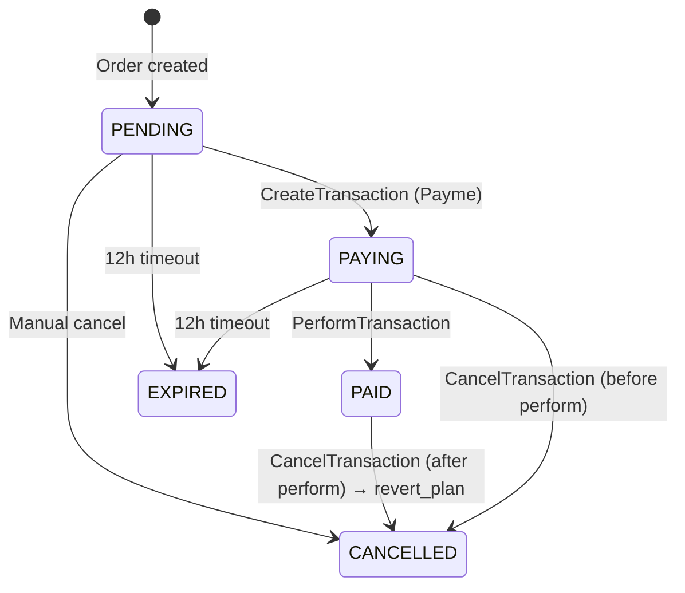

# Payment Flow

## Order State Machine



## PaymeTransaction State Machine

```mermaid
stateDiagram-v2
    [*] --> 1 : CreateTransaction
    1 --> 2 : PerformTransaction
    1 --> -1 : CancelTransaction (before perform)
    2 --> -2 : CancelTransaction (after perform)
```

States: `1` = created, `2` = performed, `-1` = cancelled before perform, `-2` = cancelled after perform.

## Payme Webhook Methods (JSON-RPC 2.0)

| Method | Description |
|--------|-------------|
| `CheckPerformTransaction` | Verify order exists, is payable, and amount matches |
| `CreateTransaction` | Create a `PaymeTransaction` and set Order → PAYING |
| `PerformTransaction` | Mark transaction as performed, call `Order.mark_as_paid()` |
| `CancelTransaction` | Cancel transaction; if after perform, call `Order.revert_plan()` |
| `CheckTransaction` | Return current transaction state and timestamps |
| `GetStatement` | Return list of transactions in a time range |

## Timeout Logic

- `PAYME_TIMEOUT_MS = 43_200_000` ms = **12 hours**
- `PaymeTransaction.is_timed_out` returns `True` when:
  - state == `STATE_CREATED` AND `now_ms - payme_create_time > PAYME_TIMEOUT_MS`
- When timeout detected during `CreateTransaction` or `PerformTransaction`:
  - Transaction moved to `STATE_CANCELLED_BEFORE` with `reason=4`
  - Order cancelled

## Idempotency Rules

- **CreateTransaction**: if `payme_id` already exists → return existing transaction (idempotent)
  - Exception: if timed out → cancel first, then return CANT_PERFORM error
- **PerformTransaction**: if already `STATE_PERFORMED` → return existing perform_time (idempotent)
- **CancelTransaction**: if already cancelled → return existing cancel_time (idempotent)

## CancelTransaction After Perform

When `CancelTransaction` is called on a `STATE_PERFORMED` transaction:
1. Transaction moved to `STATE_CANCELLED_AFTER`
2. `Order.revert_plan()` called:
   - Finds previous `PlanConfig` by `order.previous_plan`
   - Restores `org.plan`, `org.max_kitchens`, `org.max_users`, `org.mrr`
3. `AuditLog` records `PLAN_REVERT` event
